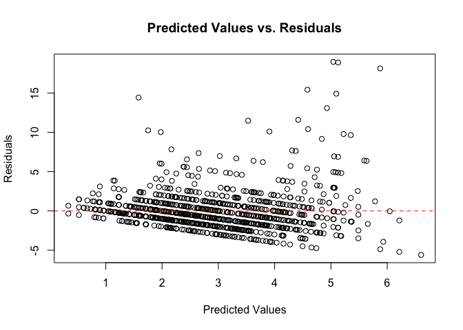

Lab 2 Report: TV watch time across generations
================
Godsee Joy, Karanveer Lamba, Deric Liang

2024-04-10

Please see "Godsee_Karanveer_Deric_Lab2_Report.Rmd" for backup code on data processing and modeling. Please also see "Godsee_Karanveer_Deric_Lab2_Presentation.pdf" for regression tables and additional data visualizations for assessing OLS modeling assumptions/results.

## Introduction

With new technologies rapidly emerging, there is reason to believe that
generational differences exist in the use of technology, specifically in
time spent watching TV. A study in China explored the relationship
between age group and TV viewing and found that the youngest groups see
a drop in TV viewing frequency.[^1] Another study in the U.S. found that
adults over 65 spent threefold more waking time watching TV than young
adults, elevating concern about negative health consequences.[^2] This
motivates our research to evaluate these findings using additional data
sources for U.S. respondents. Therefore, our research question is: Does
a person’s generation relate to the number of hours spent watching TV
daily?

## Data and Operationalization

We use 2018 observational data from the General Social Survey (GSS) to
explore the relationship between age (X concept) and hours a day
watching TV (Y concept). The GSS is a reputable, nationally
representative multi-stage area probability sample conducted via
in-person interviews, such that each unit of observation is an American
adult from different households. It collects information on each
respondent’s demographics, lifestyle, and opinions on a variety of
topics.[^3]

The 2018 GSS cross-sectional data contains responses from 2,348
individuals and includes variables for our main X concept (*age*,
metric) and Y concept (*tvhours*, metric), as well as other covariates
such as marital status (*marital*, nominal), workforce status
(*wrkstat*, nominal), highest education level (*degree*, ordinal), and
respondent family income (*coninc*, metric). Survey documentation is
unclear about whether TV hours includes using streaming services, cable,
or alternatives, so there is likely some measurement error in how
respondents interpreted this question. However, we use this as our main
outcome variable due to a lack of more precise questions in GSS, and
care more about the sedentary behavior involved with watching TV. We
hypothesize that commitments from marriage or employment would place
constraints on a respondent’s time to watch TV. Literature supports
inclusion of education and income. After confirming distributional
similarity between respondents with missing values and those without, we
removed subjects who did not provide responses for any of these
variables, leaving us with 1,421 observations.

The values for age responses vary from 18 to 89+ years, which we
categorize into the variable *age_cat* with the following generations as
per our research question: Silent Generation (73 or older), Baby Boomers
(54-72), Gen X (38-53), and Gen Z/Millennials (18-37). The values for
hours a day watching TV range from 0 to 24 hours. We consolidate marital
status of married into “married” and all other responses (divorced,
never, separated, widowed) into “not married” as well as working status
of part-time or full-time into “working” and “not working” capturing
remaining options (unemployed, laid off, keeping house, etc.) to
minimize the categories needed to meet our goal of measuring TV
watchtime constraints.

## Assumptions and Model Specifications

We use the large-sample OLS regression methodology to fit multiple
models for determining the relationship between age and TV hours. The
assumptions for this methodology require the data to be independent and
identically distributed (IID) and that a unique best linear predictor
(BLP) exists. The GSS uses representative individual sampling such that
we do not have concerns about IID violations. Additionally, we apply a
logarithmic (ln) transformation to the income variable to adjust for its
heavy right-skew and stabilize the variance and covariance measures. A
unique BLP likely exists, as none of the covariates are perfectly
collinear.

We fit six models: a basic model with metric age only, a model with
generations only, several models introducing one covariate at a time,
and finally a full model with generations and all the covariates, using
robust standard errors. ANOVA F-tests with $\alpha = 0.01$ confirm that
each model improves on the previous specification. We performed EDA on a
random 30% sample (n = 426) of the 2018 GSS data for model
specification, and verified the results with a confirmation sample of
the remaining 70% (n = 995) of the observations, as shown below. We also
considered models with household size (*hompop*, metric) and sex (*sex*,
nominal), but decided against including them due to statistically
insignificant improvements to the model based on ANOVA F-tests.

## Results

Directionally, the negative relationship of TV hours with income and
education aligns with previous literature. We also find that marriage
and employment decrease TV hours per our hypotheses, though marital
status is not statistically significant. Finally, examining the
relationship with generations with Gen Z/Millennials as a baseline, we
find that Gen X, Baby Boomer, and Silent Generation respondents watch an
average of 0.560, 1.378, and 0.991 more hours of TV a day (all else
equal), significant at an $\alpha = 0.01$ level. We find these increases
to be practically significant as well - assuming 8 leisure hours in a
day, these represent a 7%, 17%, and 12% increase in TV hours across the
respective generations (all else equal). To further assess the quality
of our regression model we prepared the following diagnostic plot of
predicted values against the residuals, and see evidence of potential
heteroskedasticity, but our use of a large sample and robust standard
errors helps mitigate this.

## Limitations

We note several limitations to our findings. First, due to missing data
in 2022, we used older data from 2018. Given the significant effects of
COVID-19 across work and leisure activity, repeating this analysis with
more recent data may yield different results. Additionally, we observed
several potential outliers for TV hours (\> 15 hours), but examining
these observations did not lead to clarity on whether these were errors,
thus we conservatively kept them given the robust sample collection
methodology used by the GSS. Next, we combined Gen Z and Millennials due
to small sample size, leading to a potential dilution in measuring
differences between them. Finally, future research could also explore
other variables that may have important relationships to TV hours, such
as seasonality, time spent on other leisure activities, and internet
usage. In conclusion, our model yielded statistically and practically
significant results. Older generations show significantly higher TV
watch time, with notable robustness as covariates are added to the
model.

[^1]: Liu, X. (2023). Household income, education level, and
    television-viewing frequency—a quantitative economic analysis.
    Academic Journal of Business & Management, 5(17).
    <https://doi.org/10.25236/ajbm.2023.051702>.

[^2]: Depp, C. A., Schkade, D. A., Thompson, W. K., & Jeste, D. V.
    (2010). Age, affective experience, and television use. American
    journal of preventive medicine, 39(2), 173–178.
    <https://doi.org/10.1016/j.amepre.2010.03.020>.

[^3]: NORC at the University of Chicago (2021). About The GSS.
    <https://gss.norc.org/About-The-GSS>.
